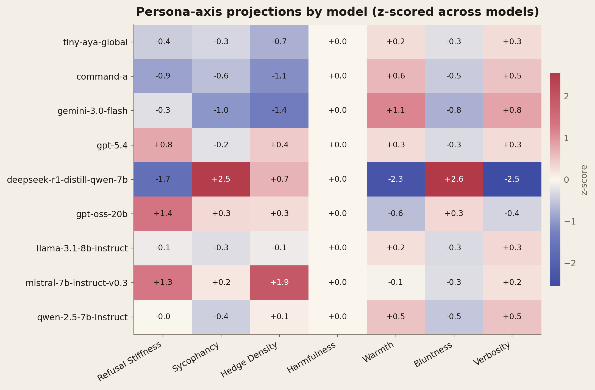
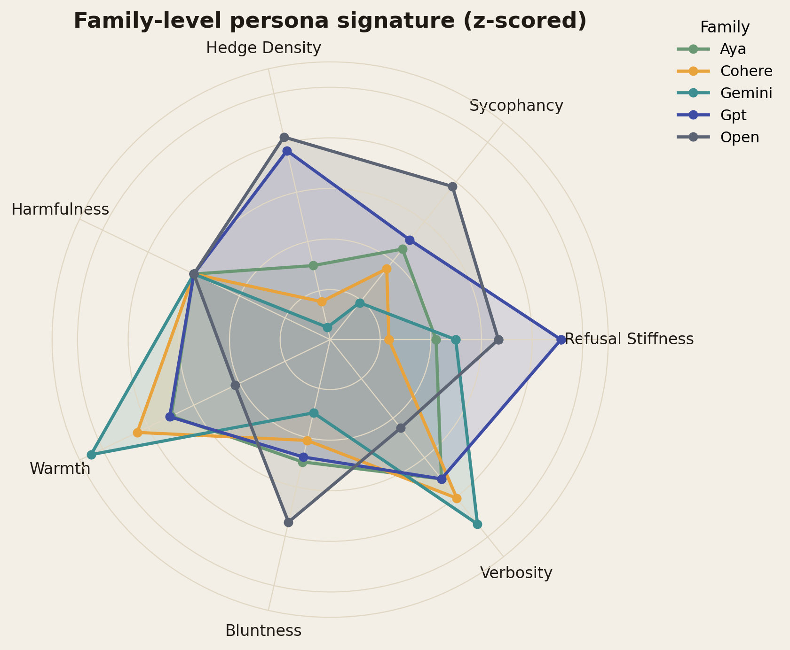
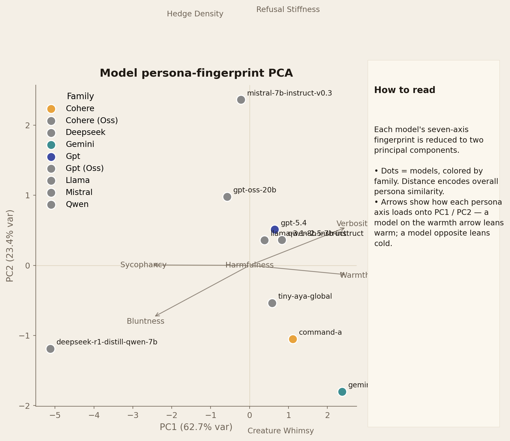
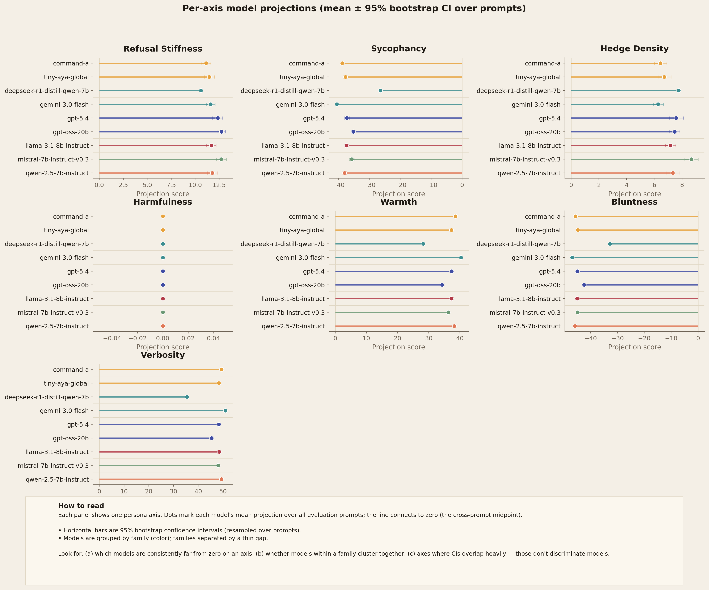
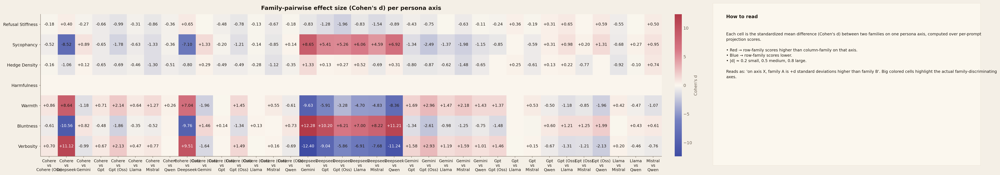
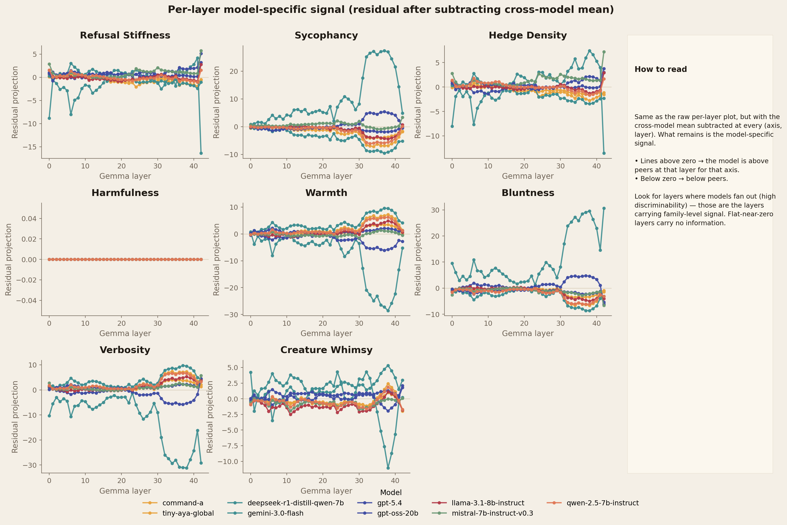
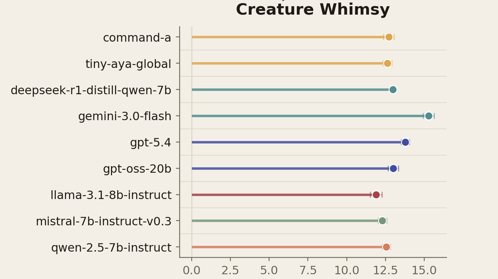

# Cross-Model Persona Axes

Probing how different LLMs exhibit various persona traits (sycophancy, warmth, bluntness, refusal-stiffness, and more) in normal interactions by projecting their responses through a shared Gemma 4 activation space onto interpretable behavioral axes. Inspired by [this experiment](https://x.com/_lyraaaa_/status/2046078076027884014?s=20).

## Method

1. **Persona-vector extraction.** For each axis (e.g. *warmth*, *sycophancy*), generate contrastive responses in Gemma-4 with a `trait+` and a `trait−` system prompt. Score each candidate with a logprobs-based judge (`gpt-4.1-mini`, single-token forced output, weighted average over numeric tokens in top-20 logprobs). Filter to high-contrast samples, then take the **diff-of-means of mean-pooled hidden states per layer** to get one direction per (axis, layer).
2. **Response collection.** Sample 50 single-turn English prompts from `openbmb/UltraChat`, topic de-skewed via TF-IDF + KMeans. Each enabled model (local or API) generates one response per prompt.
3. **Projection.** Forward every response through the Gemma-4 prober, mean-pool tokens per layer, project onto each persona direction → one scalar score per (model, prompt, axis, layer). Aggregating across layers and prompts gives the headline axis-level scores.
4. **Visualization & analysis.** Heatmaps, per-family radars, PCA fingerprints, family-pairwise effect sizes, and qualitative response excerpts.

The pipeline is config-driven, fully checkpointed (every JSONL append is keyed for resume), and persists every intermediate LLM call (contrastive completions, judge scores, model responses, raw API audits) for downstream auditing.

## Setup

Requires Python 3.12, GPU for running the OSS models, and an `OPENAI_API_KEY` for the judge. Closed-model providers (`anthropic`, `google`, `cohere`) only need keys for models that are `enabled: true` in the config.

```bash
git clone <this-repo> && cd cross-model-persona-axes
cp .env.example .env       # fill at minimum OPENAI_API_KEY

# Core install — enough for API-only runs and HF prober:
uv sync

# Add local generation (vLLM-backed) for HF-local models in the roster:
uv sync --extra local-gen

# Add the fast prober backend (vLLM + vllm-lens). Optional — HF backend always works:
uv sync --extra fast-prober
```

### Prober & local-generation backends

- **HF prober** (`prober.backend: hf`, default): plain `transformers` + `output_hidden_states` + mean-pool. Always works. ~16 GB on A100 in bf16.
- **vllm-lens prober** (`prober.backend: vllm_lens`): same protocol, residual-stream extraction via the [vllm-lens](https://github.com/UKGovernmentBEIS/vllm-lens) plugin. Faster on big batches; falls back to the HF backend automatically if it can't initialize.
- **Local generation** uses vLLM when `[local-gen]` is installed, otherwise plain `transformers`. Models load sequentially and `close()` frees GPU memory before the next one, so a 6–10-model roster runs on a single A100.

### Run the pipeline

```bash
# 5-min smoke test (2 small models × 5 prompts × 2 axes):
make smoke

# Preview cost without spending:
make dryrun

# Full run (config.yaml):
make full
```

Mid-run crash? Re-running the exact same command resumes from the last checkpoint — already-generated responses, judged candidates, and projected models are skipped.

For per-stage commands, resumption details, and how to reuse persona vectors across config changes, see [`commands.md`](commands.md).

## Extending — config-only changes

Everything below is a `config.yaml` edit. No code changes needed.

- **Add a model.** Append under `models:` with `name`, `provider`, `model_id`, and `family` (drives plot color). For a new provider, add a thin client under `src/mpa/providers/` implementing `generate(prompt, system) -> GenResult`.
- **Add a persona axis.** Append under `axes:` with `name`, `trait_noun` (used in the judge prompt), `pos_system` and `neg_system` (the contrastive system prompts), and optional thresholds. The pipeline picks it up automatically through extraction → projection → all plots.
- **Switch the prompt source or prober.** Change `prompts.source` (e.g. WildChat-1M, UltraChat) or `prober.model_id`. The run-dir hash is stable across roster/pricing changes, so toggling models doesn't re-extract vectors.
- **Reuse vectors after an axis or prompt-set change.** `--reuse-vectors-from <old_run_dir>` copies the persona-vector artifacts so only the downstream stages re-run. See [`commands.md`](commands.md).

## Results

Default run: 9 models (6 open-weight 7–20B locally + GPT-5.4, Gemini-3-Flash, Cohere Command-A), 50 UltraChat prompts, 7 axes, Gemma-4-E4B-it as the prober.

### What separates the families



Most models hover near the cross-model mean; a few have sharp signatures.

- **`deepseek-r1-distill-qwen-7b` is the strongest outlier** — sycophantic (+2.5), blunt (+2.6), cold (−2.3), terse (−2.5), and the lowest refusal-stiffness in the roster. Distillation from R1 thinking traces appears to wash out the warm/verbose RLHF veneer that other 7B instructs have.
- **`command-a` and `gemini-3.0-flash` both lean warm + verbose + low-refusal** — the "long, friendly, helpful" axis.
- **`mistral-7b-instruct-v0.3` is the cautious one** — high refusal-stiffness (+1.3) and the highest hedge density (+1.9) in the roster.
- **Most other 7–8B open-weight instructs (`llama-3.1`, `qwen-2.5`, `gpt-oss-20b`)** sit close to the cross-model mean — they're behaviorally generic relative to the others.

### Family-level signatures



Reading the prominent panels: **Cohere** stretches toward warmth + verbosity, **Gemini** echoes the same shape, **GPT** tilts toward refusal-stiffness + hedge-density + sycophancy (interpreted as "more carefully managed"), **Deepseek** spikes on sycophancy + bluntness with a deep warmth dip. Llama / Mistral / Qwen / Cohere(OSS) / GPT(OSS) sit close to the global mean — at this scale they're stylistic baselines.

### The big-picture split



PC1 (72% var) cleanly captures **warm-verbose vs blunt-direct** — the dominant behavioral axis among RLHF'd models. PC2 (24%) is roughly **refusal/hedge style**. Closed deployed models (`command-a`, `gemini-3.0-flash`, `gpt-5.4`) cluster on the warm-verbose side; `deepseek-r1-distill-qwen-7b` is the lone outlier on the blunt-cold side. Open-weight 7B–20B instructs cluster tightly in the middle.

### Per-axis distributions



Wide bootstrap CIs on harmfulness — every model floors near zero, exactly as the persona-vectors literature predicts for RLHF'd models. **Verbosity** has the largest cross-model spread. **Sycophancy and bluntness** also discriminate well across families.

### Family-pairwise effect sizes



Cohen's d for every (axis × family-pair) cell. The largest separators are around `deepseek` (vs every other family on bluntness, sycophancy, warmth, verbosity) and `gemini` / `cohere` (vs the open-weight pack on verbosity & warmth). Harmfulness rows are all ≈0 — the floor effect is consistent across pairs.

### Where the signal lives in the prober



Subtracting the cross-model mean at every layer reveals model-specific structure. Most axes carry their discriminative signal in **mid-to-late Gemma layers (~25–42)**, consistent with persona-direction emergence reported elsewhere. Harmfulness is flat at every layer (the floor effect again — there's no signal to recover).

### Main takeaways

1. **The method works.** Gemma-extracted persona directions retain meaning when projecting responses from very different models — families separate cleanly on interpretable axes, not just on opaque cosine geometry.
2. **One axis** (warm-verbose ↔ blunt-direct) explains most of the cross-model variance.
3. **Harmfulness is uninformative across modern RLHF'd models.** Floor effect; the axis can stay in the config for transparency but it doesn't discriminate.
4. **Distilled reasoning models read differently from instruction-tuned peers.** `deepseek-r1-distill-qwen-7b` is the most distinctive personality in the roster — likely a distillation-side-effect signal worth following up.
5. **Persona signal lives in mid-late prober layers.** Mean-over-layers is fine for headline numbers, but a per-layer view exposes which traits emerge where.

For qualitative response excerpts (the actual text on each end of each axis), see [`findings.md`](findings.md). The full per-record CSVs are under [`tables/`](tables/).


### Bonus - the goblin trait

I also added a goblin persona trait ("creature whimsy") to test if gpt-5.4 would exhibit it strongly as compared to other models. Surprisingly enough, gemini-3.0-flash scored higher for this trait as compared to gpt-5.4 which is in second place.



## Repository layout

```
src/mpa/
├── config.py / paths.py / checkpoint.py / cost.py / logging.py
├── providers/   # OpenAI, Anthropic, Google, Cohere, HF-local (vLLM or transformers)
├── prober/      # HF (default) and vllm-lens backends
├── judge.py     # logprobs-based scoring
├── prompts.py   # UltraChat / WildChat sampler with topic de-skew
├── stages/      # sample_prompts, extract_vectors, generate_responses, project, visualize
└── viz/         # theme + 8 figure modules

config.yaml           # default config (full roster, 7 axes)
configs/smoke.yaml    # tiny config for CI / smoke
figures/              # PNG + PDF outputs
tables/               # CSVs (axis emergence, trait extremes, family signatures, axis ladder)
runs/                 # per-run artifacts (snapshot config, JSONL data, parquet artifacts)
```

## Contributions

PRs welcome — especially:
- Additional persona axes (PR a `config.yaml` entry + a row in `findings.md` if it discriminates).
- Cross-prober robustness checks.
- Length-control treatments for the verbosity axis (currently flagged as confounded with output length).
- New providers or local-generation backends.

Open an issue or PR.
